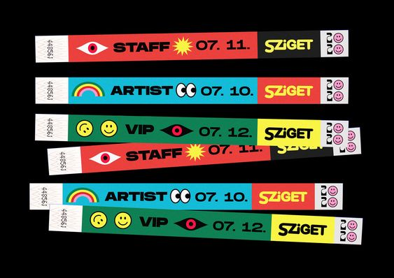
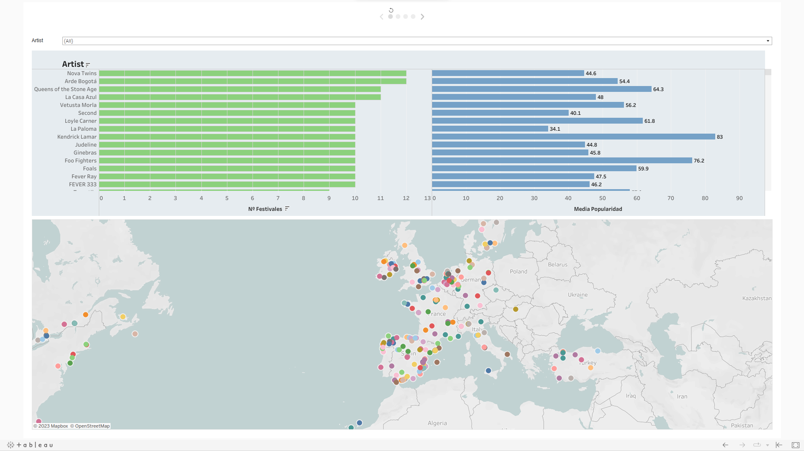
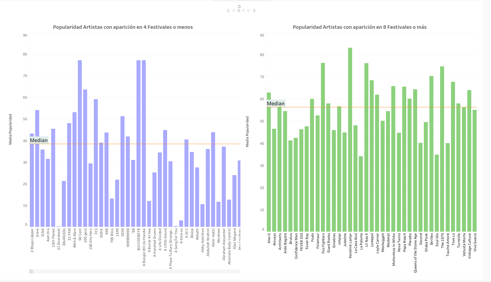
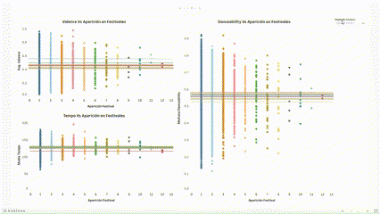
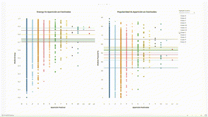

# IRONHACK_Visualización

<div style="text-align:center">
    
</div>

## Indice:
1.[📜 Descripción](#descripcion)\
2.[⏳ Desarrollo](#desarrollo)\
3.[📊 Visulización](#visualizacion)\
4.[✍️ Storytelling](#story)\
5.[🔬 Conclusiones](#conclusiones)\
6.[📁 Estructura](#Estructura)

## Descripción:<a name="descripcion"/>

Cuarto proyecto en Ironhack, donde se realizaran distintas visualizaciones sobre distintos festivales de música que se desarrollarán a lo largo de 2023, y los artistas que en ellos participan. Para ello se hará uso de la información obtenida en el anterior proyecto de Ironhack ([Ironhack_ETL](https://github.com/gusavato/3_IRONHACK_ETL)). 

Esta información se enriquecerá con información obtenida de las API's de Spotify y Google Maps. Una vez realizado el proceso de ETL, se procederá a la visualización de los mismos.


## Desarrollo:<a name="desarrollo"/>

Realizaremos el proceso siguiendo los siguientes pasos:

1- En el notebook [ETL_Fest](https://github.com/gusavato/4_IRONHACK_Visualization/blob/main/Jupyter/ETL_fest.ipynb) partimos de el dataframe de [festivales](https://github.com/gusavato/3_IRONHACK_ETL/blob/main/data/df_fest_clean.parquet) obtenido en el proyecto de la semana anterior. En este proceso formatearemos la fecha de inicio y final de cada festival, así como añadiremos las coordenadas de longitud y latitud a cada festival

2- En el notebook [ETL_Tracks](https://github.com/gusavato/4_IRONHACK_Visualization/blob/main/Jupyter/ETL_Tracks.ipynb) partimos de el dataframe de [grupos](https://github.com/gusavato/3_IRONHACK_ETL/blob/main/data/grupos_spotify_clean.parquet) obtenido en el proyecto de la semana anterior. En este proceso crearemos un datframe con el top 10 de canciones de cada artista, así como métricas propias de Spotify


## Visualización:<a name="visualizacion"/>

La información obtenida en los dos procesos de extracción se ha cargado a una base de datos de Mongo. El proceso de visualización lo realizaremos en Tableau, para poder usar los datos, debemos [exportarlos](https://github.com/gusavato/4_IRONHACK_Visualization/tree/main/data/db_mongo) en formato .json

En este [enlace](https://public.tableau.com/app/profile/augusto.abad/viz/Festivales_16841034848740/ArtistasVsFestivales) se puede ver las distintas tablas y gráficos que se han realizado. En el siguiente apartado se analizará la información que se observa en cada página.


## Storytelling:<a name="story"/>

<details>
<summary><ins><b>Festivales y Artistas</b></ins></summary>
<br>

 

</details>


En la primera página de nuestra historia podemos ver 2 gráficos de barras que relacionan los aritistas y con los festivales, y un mapa donde se muestran los festivales que tienen lugar en 2023. Esto nos permite tener una primera aproximación a como están estos dos campos relacionados

En el gráfico podemos ver por cada artista el número de festivales en los que participa, así como una medida de su popularidad. Esta popularidad es la media de la populardidad del top 10 de canciones del artista en Spotify.

Tanto el mapa como el gráfico es interactivo y podemos ir explorando tanto artistas como festivales

<br>

<details>
<summary><ins><b>Popularidad por artista</b></ins></summary>
<br>

 

</details>


En la segunda página de nuestra historia podemos ver 2 gráficos de barras donde se ve la media de popularidad de cada artista. En el gráfico de la izquierda podemos observar la popularidad de aquellos artistas que actúan en 4 festivales o menos, y a la derecha igual pero sólo los artistas que actúan en 8 festivales o más.

En ambos gráficos podemos observar una línea horizontal que indica la mediana de popularidad para cada grupo. Vemos que hay una diferencia significativa entre la mediana de ambos grupos. 

¿Afectará la popularidad a que tenga una presencia menor o mayor en festivales?

¿Aparte de la popularidad, habrá otra métrica que pueda afectar a la presencia de un artista en mas o menos festivales?

<br>

<details>
<summary><ins><b>Danceability, Tempo y Valence por artista</b></ins></summary>
<br>

 

</details>


En la tercera página de nuestra historia analizaremos el impacto de tres métricas distintas, que otorga [Spotify](https://developer.spotify.com/documentation/web-api/reference/get-several-audio-features) a las canciones, a la hora de aparecer en uno o más festivales.

Las métricas que vamos a analizar son:

* **Danceability:** Métrica que clasfica una canción por su predisposición a ser "bailable"
    > Danceability describes how suitable a track is for dancing based on a combination of musical elements including tempo, rhythm stability, beat strength, and overall regularity. A value of 0.0 is least danceable and 1.0 is most danceable.

* **Tempo:** Métrica que mide el número de beats por minuto de una canción
    >The overall estimated tempo of a track in beats per minute (BPM). In musical terminology, tempo is the speed or pace of a given piece and derives directly from the average beat duration.

* **Valence:** Métrica que estiva el "positivismo" de una canción
    >A measure from 0.0 to 1.0 describing the musical positiveness conveyed by a track. Tracks with high valence sound more positive (e.g. happy, cheerful, euphoric), while tracks with low valence sound more negative (e.g. sad, depressed, angry)

A los distintos artistas los agruparemos en 12 clústers, según su número de apariciones por festival (clúster 1: Artistas con una aparición, clúster 2: artistas con 2 apariciones,...)

Si navegamos por cada cluster, vemos que la media de cada métrica no varía mucho. Esto nos indica que estas tres métricas que hemos analizado, no afectan a la hora de determinar la presencia o no de un artista en más o menos festivales.  

<br>

<details>
<summary><ins><b>Popularidad y Energy por artista</b></ins></summary>
<br>

 

</details>

Parecido de como se ha hecho en la anterior página, analizaremos las siguientes métricas. 

* **Popularity:** Métrica que mide la popularidad de una canción.
    >The popularity of the album. The value will be between 0 and 100, with 100 being the most popular.

* **Energy:** Métrica que mide la intensidad de una canción
    >Energy is a measure from 0.0 to 1.0 and represents a perceptual measure of intensity and activity. Typically, energetic tracks feel fast, loud, and noisy. For example, death metal has high energy, while a Bach prelude scores low on the scale. Perceptual features contributing to this attribute include dynamic range, perceived loudness, timbre, onset rate, and general entropy.

A diferencia de las anteriores tres métricas, se puede intuir un impacto de *Energy* y *Popularity* a la hora de influir a un artista en que aparezca en más festivales

## Conclusiones:<a name="conclusiones"/>

Tras revisar distintas métricas que evaluan el top 10 de canciones de cada artista. Hemos observado que solo dos (*Energy* y *Popularity*), tienen indicios de poder influir a la hora de que un artista actúe en más festivales. 

Para poder certificar esta influencia, deberíamos disponer de una muestra más grande (tanto de festivales como de canciones), ya que los artistas que actúan en 10, 11 y 12 festivales son pocos, así como las canciones de cada artista que son solo 10.

## Estructura:<a name="Estructura"/>

```
root 
|__ data/               # Contiene todos los datos que se han recogido en el proyecto            
|   |__ db_mongo/       # Archivos .json con los datos ya cargados en la DB
|
|__ images/             # Contiene la imágenes que se han usado en el proyecto   
|
|__ jupyter/            # Alberga los 32notebooks usados en el proyecto
|
|__ .gitignore          # Archivo gitignore     
|
|__ README.md           # Descripción del proyecto